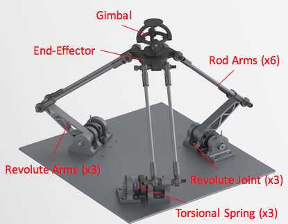

# Delta Mechanism

In this research project, we aim to build a mobile manipulator with a Delta platform,
which has 3 degrees of freedom in XYZ directions. The [video](https://www.youtube.com/watch?v=gFc7Y-O5YaY)
demostrates the mechanism.

This repository includes kinematics and a control implementation of the Delta platform.
The detailed theoratical analysis is included in the [Thesis](Thesis.pdf)

### Delta MATLAB code

[Delta_MATLAB_code](/Delta_MATLAB_code) has a self-contained MATLAB library of Delta platform.
The code is used to calculate kinematics and plot workspace given parameters of the mechanism.

### Delta C code

[Delta_C_code](/Delta_C_code) is a C version of the MATLAB library. The C library is used for
real-time control with microcontrollers.

### Encoders

[Encoders](/Encoders) has C functions to read the encoders applied in the project.

Two kinds of revolute encoders are used in the system. Three 12-bit encoders are used to measure angles of
gimbal, and six 23-bit encoders is used to measure angles of torsion springs.

### System Demo

Since we do not have a motor controller yet, [System_Demo](/System_Demo) made a demo of the whole control system
of this platform with three DC brushed motors and four NU32 microcontrollers to simulate the system.
