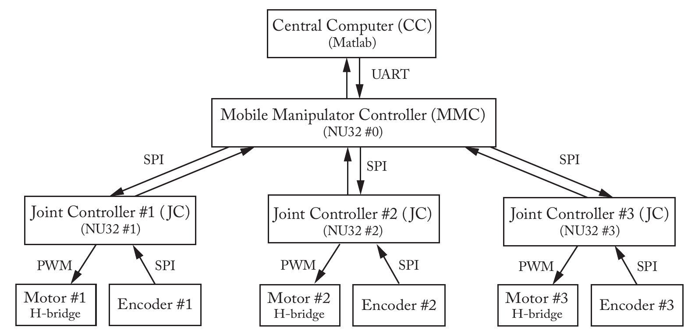

# System Demo

This demo simulates the control system

We used an NU32 as the MMC, three NU32s as the JCs, and used them to drive three
independent brushed DC motors using the ME333 motor control board. The MMC communicates
with a host computer simulator through a MATLAB client.
